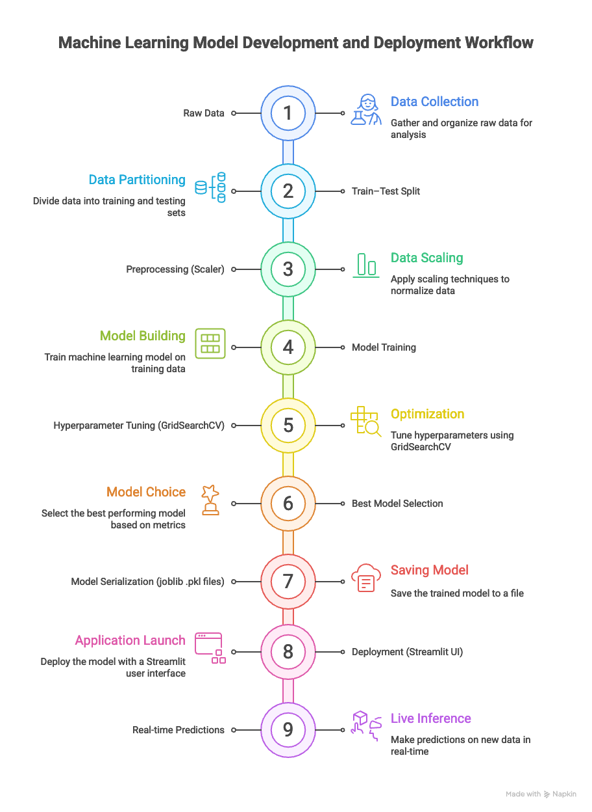

# Introduction to MLOps

MLOps is the application of DevOps principles to machine learning workflows and focuses on automating and managing the complete lifecycle of machine learning models in production. It helps organizations build, deploy, monitor, and maintain ML models in a reliable and scalable way.

## What is MLOps

MLOps is a combination of machine learning and DevOps practices that aims to streamline the end-to-end ML pipeline. It uses tools and processes to automate data preparation, model training, testing, deployment, and monitoring so that machine learning systems can be managed efficiently in real-world environments.

## Importance of MLOps in Machine Learning

MLOps is important because machine learning models need continuous maintenance after deployment. Over time, data patterns change and model performance can degrade. MLOps helps reduce time to market, improve model accuracy through continuous monitoring, scale models for large datasets, and minimize risks by enforcing testing and compliance standards.

## Why We Need MLOps

Machine learning models are complex and difficult to deploy compared to traditional software. MLOps provides a structured framework to manage this complexity and ensures smooth deployment and maintenance. It also enables continuous updates and improvements, making models more reliable and relevant over time while reducing manual effort and errors through automation.

## Components of MLOps

MLOps consists of multiple components that work together across the ML lifecycle. Data management ensures the availability of high-quality data, model development focuses on building efficient and accurate models, model deployment handles serving models in production, model monitoring tracks performance and drift, and model management oversees versioning, testing, and optimization.

## MLOps Pipeline and Its Challenges

The MLOps pipeline includes data preparation, model development, testing, deployment, and monitoring. Data preparation involves cleaning and transforming data, which can be challenging due to missing or inconsistent values. Model development focuses on algorithm selection and tuning while avoiding overfitting. Testing ensures the model performs well on real-world data. Deployment can be complex without automation, and monitoring is required to detect performance issues and data drift after deployment.

## Best Practices for Implementing MLOps

Successful MLOps implementation requires strong collaboration between data scientists, developers, and operations teams. Automation is essential to speed up training, testing, and deployment processes. Version control helps track changes in code, data, and models, while thorough testing and continuous monitoring ensure reliability and quick issue detection.

## Key Principles of MLOps

MLOps is built on principles such as CI/CD automation, workflow orchestration, reproducibility, collaboration, continuous training and evaluation, monitoring, metadata logging, and feedback loops. These principles ensure that ML pipelines are repeatable, scalable, and continuously improving.

## Tools and Technologies Used in MLOps

Several tools support MLOps practices across different stages of the ML lifecycle. Kubernetes is commonly used for model deployment and scaling, TensorBoard helps visualize training performance, PyTorch is used for model development, and MLflow supports experiment tracking and model lifecycle management.

## Benefits and Challenges of MLOps

MLOps offers benefits such as improved model performance, faster deployment, better scalability, and reduced operational risk. However, it also presents challenges, including increased system complexity, the need for specialized skills, data quality management, and regulatory compliance.

## Future of MLOps

As machine learning continues to expand across industries, MLOps will become increasingly important. The future of MLOps will likely involve higher levels of automation, stronger collaboration between teams, and advanced tools that simplify the management of end-to-end machine learning pipelines.

## What is a Machine Learning Pipeline?

A Machine Learning Pipeline is an organized, step-by-step workflow that automates the process of building, training, evaluating, and deploying machine learning models. Instead of handling each task separately, a pipeline connects all stages into a single, repeatable process.

A typical machine learning pipeline includes stages such as data collection, preprocessing, feature engineering, model training, evaluation, and deployment.

The main purpose of using a pipeline is to make machine learning development faster, more reliable, and easier to scale. Pipelines also help manage data efficiently by supporting extraction, transformation, and loading (ETL) from different data sources.

## Why Use a Machine Learning Pipeline?

Without a pipeline, machine learning workflows can become messy and error-prone. Pipelines help by:

- Standardizing the entire ML workflow

- Reducing manual effort and human errors

- Ensuring consistent preprocessing during training and prediction

- Making models easier to deploy and maintain

# Steps to Build a Machine Learning Pipeline

A machine learning pipeline follows a logical sequence of steps that automate data preparation, model training, and deployment.

### Step 1: Data Collection and Preprocessing

The first step is gathering data from various sources such as databases, APIs, or CSV files. Once collected, the data is cleaned by:

Handling missing values

Removing duplicates and incorrect entries

Normalizing or standardizing numerical features

Converting categorical variables into machine-readable formats

### Step 2: Feature Engineering

Selecting the most relevant features

Creating new features through transformation or extraction

Removing unnecessary or redundant features

Good feature engineering often has a bigger impact than model choice.

### Step 3: Data Splitting

The dataset is divided into:

Training set

Validation set

Testing set

### Step 4: Model Selection and Training

Based on the problem type (classification, regression, clustering, etc.), an appropriate algorithm is selected.

The model is then trained using the training dataset while learning patterns from the data.

### Step 5: Model Evaluation and Optimization

After training, the model’s performance is evaluated using metrics such as:

Accuracy

Precision

Recall

F1-score

To improve performance and avoid overfitting:

Hyperparameters are tuned using Grid Search or Random Search

Cross-validation is applied for reliable evaluation

### Step 6: Model Deployment

Once the model performs well, it is deployed for real-world use.

Common deployment approaches include:

1. REST APIs using Flask or FastAPI

2. ML frameworks like TensorFlow Serving

3. Cloud-based deployment solutions

### Step 7: Continuous Learning and Monitoring

After deployment, the pipeline does not stop.

This step includes:

Monitoring model performance in production

Detecting data drift or performance degradation

Retraining models using new data when needed

MLOps tools such as MLflow or Kubeflow are commonly used to automate and manage this stage.